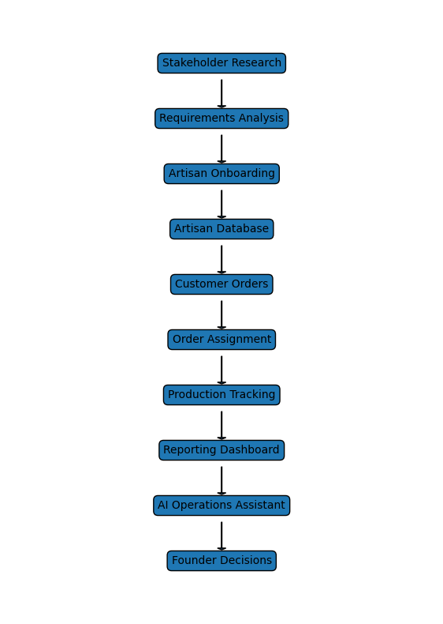

# Aesthetics: Operational Intelligence & Artisan Analytics

Aesthetics is a social impact venture, developed during the Tufts MSIM program, focused on connecting rural Indian women artisans with customers seeking sustainable, personalized, and culturally rooted products for gifting, festivals, and events.

This repository serves as a functional prototype of the data infrastructure and operational workflows required to scale the venture. Drawing on real operational frameworks, this trial environment bridges the gap between raw artisan data and executive decision-making.

---

## 📊 Venture Scope & Objectives
The goal of this operational analysis is to transition Aesthetics from early-stage venture validation into a scalable, data-driven business model. The systems modeled here manage:
* **Revenue Optimization:** Identifying high-value customer segments and product categories.
* **Fulfillment Visibility:** Tracking delivery timelines to mitigate B2B relationship risks.
* **Capacity Planning:** Monitoring artisan workloads to prevent burnout and production bottlenecks across regional groups.

## 🛠️ Tech Stack & Skills Demonstrated
* **Languages & Libraries:** Python (`pandas`, `openpyxl`)
* **Tools:** Microsoft Excel, VS Code, Git/GitHub
* **BA Competencies:** Requirements Analysis, KPI Development, Stakeholder Management, Process Improvement, Data Storytelling

---

## 📈 Python Operations Analysis (Prototype)
To model the venture's data capabilities, an automated Python pipeline (`aesthetics_report.py`) was developed to ingest multi-sheet operational datasets (`Aesthetics_Project.xlsx`) encompassing order logs, artisan capacity metrics, and stakeholder records. 

The script dynamically calculates revenue drivers, fulfillment delay rates, and group utilization metrics, outputting an executive-ready weekly summary.

### 🔥 Key Strategic Insights Generated
Based on the prototype data run, the following business recommendations were identified for scaling:

**1. Revenue Focus: Capitalize on High-Value Demand**
* **Finding:** The *Wooden Toys* category, specifically tailored for *Wedding* settings, is the primary revenue driver.
* **Recommendation:** Shift sales efforts toward standardized, high-margin B2B wedding packages rather than ad-hoc individual orders.

**2. Risk Mitigation: Introduce Milestone Tracking**
* **Finding:** The modeled workflow highlights a **20.7% operational delay rate**, severely risking relationships with timeline-strict event planners.
* **Recommendation:** Implement regional checkpoints (e.g., material acquisition, mid-assembly) within the logistics workflow to catch delays before the final delivery window.

**3. Supply Management: Balance Capacity via Upskilling**
* **Finding:** The *Embroidery* artisan cohort is operating at a localized high strain level (**20.5% capacity utilization**), creating a production bottleneck.
* **Recommendation:** Transition incoming orders to under-utilized craft groups and launch peer-led upskilling programs to build cross-functional capacity across regions.

---

## 🔄 Operations Workflow Concept
To support these findings, a milestone-based tracking architecture has been mapped out to enhance visibility across the rural artisan network:

---

## 🖥️ Interactive Solution Prototype (Lovable)
To operationalize the "Milestone Tracking" recommendation, an interactive front-end prototype was developed. This dashboard is designed for regional coordinators to update delivery statuses and monitor artisan capacity in real-time, bridging the gap between raw data and field operations.

🔗 **[View the Live Prototype Here](https://lovable.dev/projects/16eac5fb-d580-413d-a908-934f9e6f4f00)**
<table>
  <tr>
    <td align="center"> <b>Dashboard Overview</b></td>
    <td align="center"> <b>About</b></td>
  </tr>
  <tr>
    <td align="center"> <b>Shop</b></td>
    <td align="center"> <b>Purchase</b></td>
    <td align="center"> <b>Our mission</b></td>
    <td align="center"> <b>About Artisans</b></td>
  </tr>
  <tr>
    <td align="center"> <b>Customization</b></td>
    <td align="center"> <b>Contact Us</b></td>
  </tr>
</table>

*Note: This prototype models the user interface and workflow requirements necessary for the venture's logistics team to execute the proposed supply management strategies.*

---
## 🚀 Future Direction
To further build upon this operational foundation, planned iterations for this infrastructure include:
* Developing an interactive **Tableau / Power BI** dashboard for real-time capacity visualization.
* Mapping out the specific Jira workflows required for the logistics team to track the newly proposed milestone checkpoints.

---
*Aesthetics was inspired by the belief that traditional handmade art should continue to thrive while creating sustainable earning opportunities for rural women artisans through culturally meaningful products and community-centered business models.*
